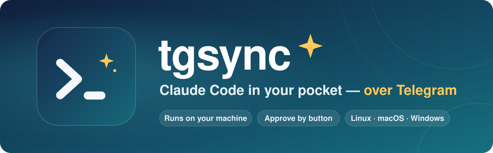
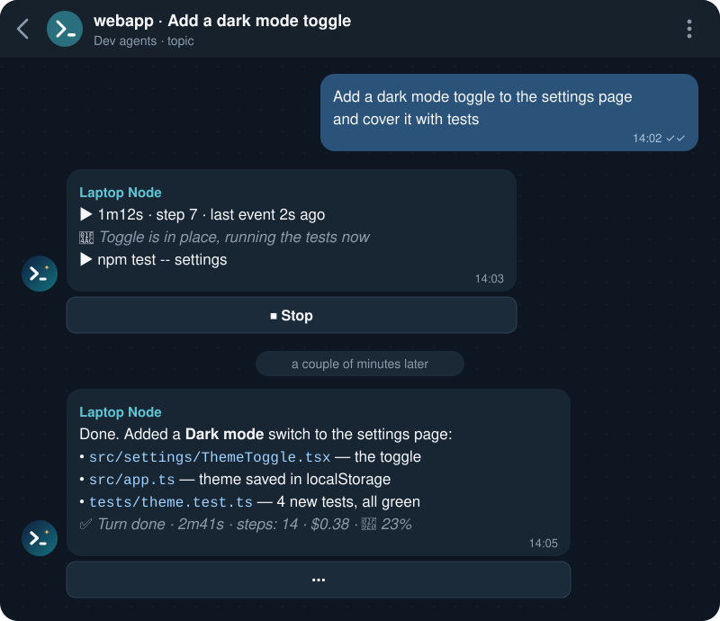
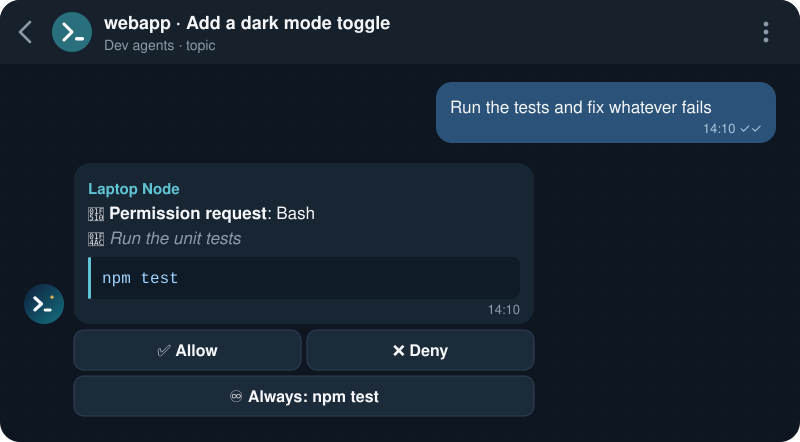
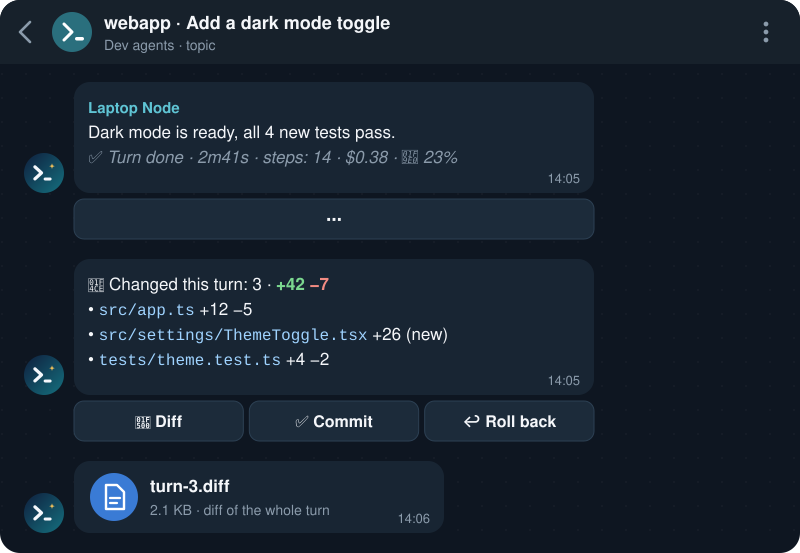
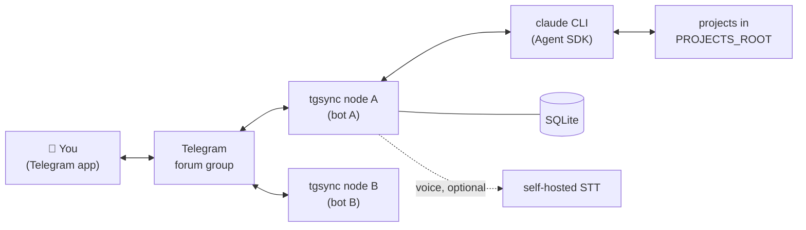

<div align="center">



<h3>Run Claude Code on your own machines. Drive it from Telegram.</h3>

<p>
Give the agent a task from your phone, watch it work, approve commands with a tap,<br>
review the diff and commit — while the code, tools and credentials stay on your computer.
</p>

<p>
<a href="https://github.com/ArthurKrantsevich/tgsync/actions/workflows/ci.yml"></a>
<a href="https://github.com/ArthurKrantsevich/tgsync/releases"></a>
<a href="go.mod"></a>
<a href="LICENSE"></a>

<a href="CONTRIBUTING.md"></a>
</p>

<p><b>English</b> · <a href="README.ru.md">Русский</a></p>

<p>
<a href="#features">Features</a> ·
<a href="#screenshots">Screenshots</a> ·
<a href="#quick-start">Quick start</a> ·
<a href="#documentation">Docs</a> ·
<a href="#security">Security</a>
</p>

</div>

---

## Why tgsync

Claude Code works best on a real machine — with your repositories, toolchains, plugins, skills and hooks. Long tasks, though, do not need you at the keyboard. **tgsync keeps the agent where your code lives and moves only the conversation to Telegram**, so you can start, steer and review work from anywhere, and every risky action still waits for your tap.

Each machine running tgsync is a **node** with its own bot. All nodes share one Telegram forum group: every node gets a control topic `🖥 <node name>` with a pinned status card, and every agent session gets its own topic.

> [!NOTE]
> The bot speaks English or Russian: set `BOT_LANGUAGE=en` (the default) or `BOT_LANGUAGE=ru` in `.env`. The documentation is available in both languages; the English docs quote the English labels.

## Features

<table>
<tr>
<td width="33%" valign="top">

### 💬 Sessions in topics
One topic per session. Start new projects and sessions from Telegram; sessions resume after a crash or a restart.

</td>
<td width="33%" valign="top">

### 📡 Live status
Elapsed time, step count, the current action and the agent's latest remark, updated as the turn runs, with a stop button.

</td>
<td width="33%" valign="top">

### 🔐 Permissions as buttons
Allow once, deny, or **Always** with deliberately narrow rules. Node-wide approve modes.

</td>
</tr>
<tr>
<td valign="top">

### 📎 Turn summary
Changed files with `+/−` line stats. Whole-turn **diff** as a file, **commit** via the agent, confirmed **rollback**.

</td>
<td valign="top">

### ❓ Agent questions
`AskUserQuestion` prompts arrive as buttons, including multiple choice and free-text answers.

</td>
<td valign="top">

### 📁 Files both ways
The agent sends documents it wrote; you send files and screenshots. `/ls` browser and `/file` for any project file.

</td>
</tr>
<tr>
<td valign="top">

### 🎙 Voice messages
Transcribed by a self-hosted speech-to-text server. The agent restates the task and waits for your "yes".

</td>
<td valign="top">

### 🤖 Subagents panel
Who is running, on what, who started them. Stop an agent or fetch its full result.

</td>
<td valign="top">

### 📊 Usage and limits
Context fill with one-tap compact, token usage per session and node, subscription limit alerts.

</td>
</tr>
<tr>
<td valign="top">

### 🕘 History
`/history` continues any Claude Code session from the terminal or desktop app — as a fork if it is still active.

</td>
<td valign="top">

### 🔑 sudo via Telegram
Per-command approval; the password comes from `.env` or is typed in the chat and deleted right away. Off by default.

</td>
<td valign="top">

### 🖥 Many machines, one group
Linux (systemd), macOS (launchd), Windows (Task Scheduler), Docker optional. Plugin profiles per project or session.

</td>
</tr>
</table>

## Screenshots

<div align="center">

**A session topic** — the task, the live status of the turn, the agent's answer



<br><br>

**A permission request** — nothing risky runs without your tap



<br><br>

**A turn summary** — review the diff, commit, or roll back



<sub>Illustrations with a fictional project; the button labels are real, for the default English interface (<code>BOT_LANGUAGE=en</code>). With <code>BOT_LANGUAGE=ru</code> the bot speaks Russian.</sub>

</div>

## How it works



A node is a single Go binary. It long-polls the Telegram Bot API for its bot, starts one `claude` process per active session through a Go client for the Claude Agent SDK protocol, answers the agent's permission callbacks with Telegram buttons, and keeps its state (sessions, rules, usage) in a local SQLite database. Nodes do not talk to each other; they only share the group.

## Quick start

**You need:** Linux, macOS or Windows 10/11 · [Claude Code](https://docs.claude.com/en/docs/claude-code) installed and logged in (`claude` on `PATH`; on Windows the native `claude.exe` and Git for Windows) · Go (the version in `go.mod`) to build from source · a Telegram account.

1. **Create a bot** with [@BotFather](https://t.me/BotFather) (`/newbot`) and copy its token. Every machine needs its own bot.
2. **Create a Telegram group**, enable **Topics**, and add the bot as an administrator with **Manage topics** (also **Pin messages**, **Change group info** and **Delete messages** for the full experience).
3. **Find the ids**: your user id (e.g. via [@userinfobot](https://t.me/userinfobot)) and the group id, which starts with `-100` (see [setup § 2.5](docs/en/setup.md#25-find-the-group-id)).
4. **Get tgsync and configure it:**
   ```bash
   git clone https://github.com/ArthurKrantsevich/tgsync.git
   cd tgsync
   cp .env.example .env
   chmod 600 .env
   ```
   Fill in the four required values:
   ```ini
   TELEGRAM_BOT_TOKEN=123456:ABC-replace-with-your-token
   ALLOWED_USER_IDS=123456789
   GROUP_CHAT_ID=-1001234567890
   PROJECTS_ROOT=/home/user/projects
   ```
   Optionally add `BOT_LANGUAGE=ru` for the Russian interface (English by default).
5. **Check the setup:**
   ```bash
   make check          # builds ./bin/tgsync and runs "tgsync check"
   ```
6. **Install it as a service** for your platform (below).
7. **Say hello:** open the `🖥 <NODE_NAME>` topic in the group, send `/menu`, then `/new myproject your task`.

<details>
<summary><b>🐧 Linux</b> — systemd user service</summary>

```bash
make install        # same as: sh scripts/install.sh
```

Builds `~/.local/bin/tgsync`, moves `.env` into `~/.config/tgsync`, runs `tgsync check`, writes and starts a systemd user service, and enables linger so the node runs without an active login. If enabling linger fails:

```bash
sudo loginctl enable-linger "$USER"
```

Logs: `journalctl --user -u tgsync -f` or `make logs`.

</details>

<details>
<summary><b>🍎 macOS</b> — launchd agent</summary>

```bash
make install
```

Same steps as Linux; the node folder is `~/Library/Application Support/tgsync`, the service is the launchd agent `dev.tgsync`, logs go to `~/Library/Logs/tgsync.log`. A launchd user agent runs only while you are logged in.

</details>

<details>
<summary><b>🪟 Windows</b> — Task Scheduler</summary>

In PowerShell, from the repository folder:

```powershell
Copy-Item .env.example .env
notepad .env
powershell -ExecutionPolicy Bypass -File scripts\install.ps1
```

Registers the task `tgsync` for your user (starts at logon, no administrator rights needed). Logs: `%APPDATA%\tgsync\tgsync.log`. There is no sudo on Windows.

</details>

<details>
<summary><b>🐳 Docker</b> — compose (Linux hosts)</summary>

Put `.env` into `~/.config/tgsync/.env` on the host, then:

```bash
test -f ~/.claude.json || touch ~/.claude.json
TGSYNC_UID=$(id -u) TGSYNC_GID=$(id -g) \
  docker compose --env-file ~/.config/tgsync/.env up -d --build
docker compose logs -f
```

The container runs as your user and shares `~/.claude` and `PROJECTS_ROOT` with the host. No container images are published; the `Dockerfile` builds one locally. See the limits in [setup § 5.4](docs/en/setup.md#54-docker-compose).

</details>

<details>
<summary><b>📦 Release archive</b> — no Go needed</summary>

Download the archive for your platform and `checksums.txt` from [Releases](https://github.com/ArthurKrantsevich/tgsync/releases), then:

```bash
sha256sum -c checksums.txt --ignore-missing
mkdir tgsync && tar xzf tgsync_*_linux_amd64.tar.gz -C tgsync && cd tgsync
cp .env.example .env && chmod 600 .env   # fill it in
sh scripts/install.sh                    # or scripts\install.ps1 on Windows
```

On macOS, clear the Gatekeeper quarantine with `xattr -d com.apple.quarantine tgsync`.

</details>

Full instructions, including the voice server, backup, upgrade and uninstall: **[docs/en/setup.md](docs/en/setup.md)**.

## Approve modes

`/approve` (or **🔐 Auto-approve** in the menu) sets the mode for the whole node:

| Mode | Behaviour |
|---|---|
| 🔴 **Ask me** *(default)* | A button for every action the built-in rules and your **Always** rules do not allow. |
| 🟡 **All but sudo** | Everything runs without asking; sudo still gets a button. |
| 🟢 **Allow all** | Every command runs without asking, sudo included (if sudo is enabled). |

In every mode, questions from the agent and commands that may touch tgsync's own folder (`.env`, database) still come as buttons. Read [security.md](docs/en/security.md#what-the-agent-can-do-in-each-mode) before switching to 🟡 or 🟢.

## Documentation

| | English | Русский |
|---|---|---|
| 🚀 Setup and maintenance | [setup](docs/en/setup.md) | [установка](docs/ru/setup.md) |
| ⚙️ Configuration (`.env`, profiles, sudo, voice) | [configuration](docs/en/configuration.md) | [настройка](docs/ru/configuration.md) |
| 📖 User guide | [usage](docs/en/usage.md) | [как пользоваться](docs/ru/usage.md) |
| 🛡 Security | [security](docs/en/security.md) | [безопасность](docs/ru/security.md) |
| 📐 Design spec | [spec](docs/en/spec.md) | [спецификация](docs/ru/spec.md) |
| 🩺 Troubleshooting | [troubleshooting](docs/en/troubleshooting.md) | [решение проблем](docs/ru/troubleshooting.md) |

Also: [CHANGELOG](CHANGELOG.md) · [CONTRIBUTING](CONTRIBUTING.md) · [SECURITY](SECURITY.md)

## FAQ

<details>
<summary><b>Does my code leave my machine?</b></summary>

The agent runs on your machine through your own Claude Code, exactly as in the terminal. What reaches Telegram is the conversation: your messages, the agent's answers, commands in permission requests, turn summaries and the files and diffs you ask for. Apart from Telegram and Claude Code itself, tgsync calls no third-party services; voice recognition runs on your own server.

</details>

<details>
<summary><b>Can several machines share one bot?</b></summary>

No. Telegram lets only one process receive updates for a bot token, so every node needs its own bot. All nodes can live in the same group: same `GROUP_CHAT_ID` and `ALLOWED_USER_IDS`, different `NODE_NAME`s.

</details>

<details>
<summary><b>Can I continue a session I started in the terminal?</b></summary>

Yes: `/history` lists recent Claude Code sessions of the projects in `PROJECTS_ROOT`, including terminal and desktop-app ones. If a session is still active, Telegram continues a copy (fork), so two processes never write to the same history.

</details>

<details>
<summary><b>What happens if the node restarts in the middle of a turn?</b></summary>

Open sessions are restored on start. Send any message to the topic and the session continues with the same context.

</details>

<details>
<summary><b>Do diff, commit and rollback work in any project?</b></summary>

They need a git project: tgsync snapshots the working tree before and after each turn through a temporary index, leaving your index, branches and stash untouched. Outside git the turn summary still lists the changed files, but has no buttons.

</details>

<details>
<summary><b>Is the bot available in English?</b></summary>

Yes. English is the default; set `BOT_LANGUAGE=ru` in `.env` for Russian (`BOT_LANGUAGE=en` switches back) and restart the node. The language covers the bot's messages and buttons, the command descriptions in Telegram, `tgsync check` and the install scripts. The documentation is available in both languages.

</details>

## Security

tgsync lets whoever controls the bot run an agent as your OS user, so it is built to be careful by default:

- 🔒 **Only allowed users.** Messages and buttons from anyone outside `ALLOWED_USER_IDS` are silently ignored; a node works only in its own group and topics.
- ✋ **Ask by default.** Every risky action waits for a tap; **Always** rules are deliberately narrow and are never offered for shells, interpreters, destructive commands or sudo.
- 🗝 **Secrets stay out of reach.** The agent's tools cannot read `.env` or the database, the bot token is removed from the agent's environment, and the sudo password never reaches the agent.
- 🏠 **No third-party services.** Only Telegram and Claude Code; speech-to-text is self-hosted.

Keep the group private — everyone in it sees the agent's output — and remember that Telegram bot messages are not end-to-end encrypted. Read **[docs/en/security.md](docs/en/security.md)** before enabling auto-approve or sudo, and report vulnerabilities privately as described in **[SECURITY.md](SECURITY.md)**.

## Contributing

Bug reports, fixes and focused improvements are welcome. For anything larger than a small fix, please open an issue first. Build with `make build`, test with `make test` (tests must pass with `-race`), and see **[CONTRIBUTING.md](CONTRIBUTING.md)** for formatting, platform notes and the commit style.

## Releases

Pushing a `v*` tag builds archives with GoReleaser for Linux, macOS and Windows (amd64 and arm64) and attaches them to a draft GitHub release, which is published by hand. See the [CHANGELOG](CHANGELOG.md).

## License

[MIT](LICENSE) © 2026 Arthur Krantsevich

---

<div align="center">
<br>
<sub>Built with Go · Made for people who would rather not babysit a terminal</sub>
</div>
