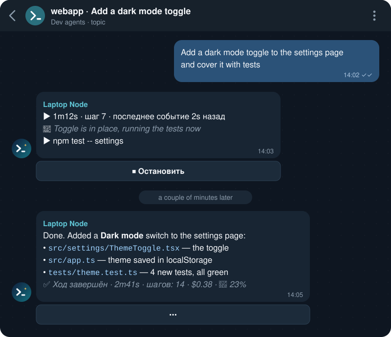
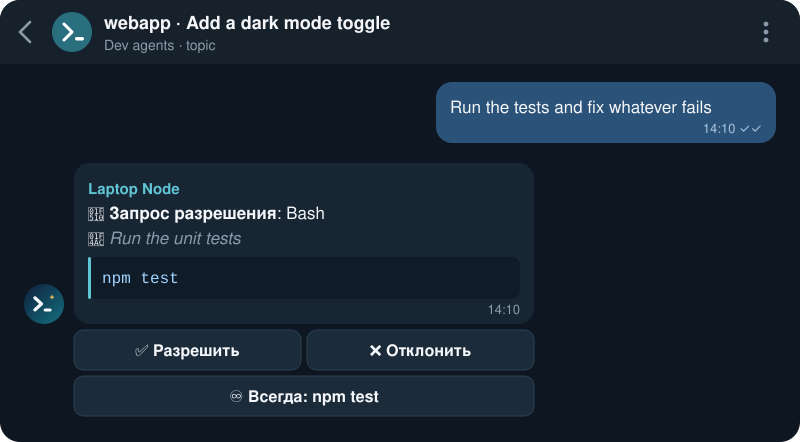
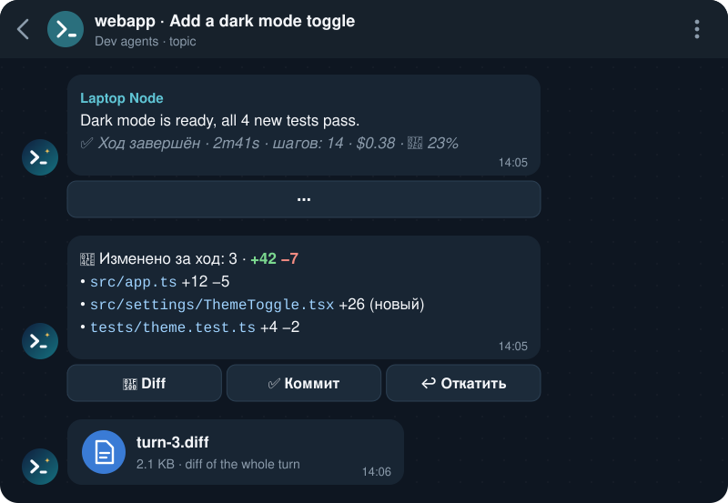
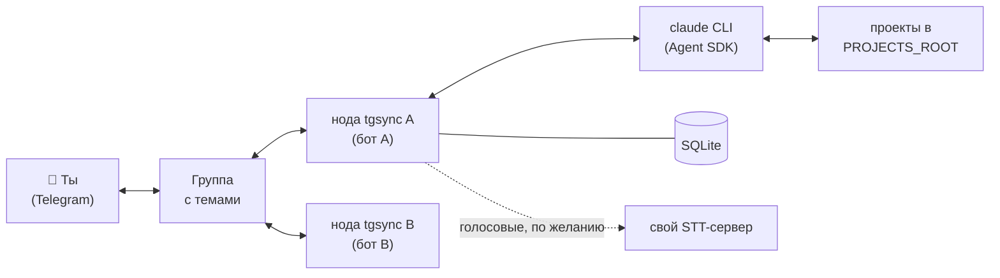

<div align="center">


<h3>Claude Code на твоих машинах. Управление — из Telegram.</h3>

<p>
Ставишь задачу с телефона, следишь за работой, одобряешь команды одной кнопкой,<br>
смотришь diff и коммитишь — а код, инструменты и доступы остаются на твоём компьютере.
</p>

<p>
<a href="https://github.com/ArthurKrantsevich/tgsync/actions/workflows/ci.yml"></a>
<a href="https://github.com/ArthurKrantsevich/tgsync/releases"></a>
<a href="go.mod"></a>
<a href="LICENSE"></a>

<a href="CONTRIBUTING.md"></a>
</p>

<p><a href="README.md">English</a> · <b>Русский</b></p>

<p>
<a href="#возможности">Возможности</a> ·
<a href="#скриншоты">Скриншоты</a> ·
<a href="#быстрый-старт">Быстрый старт</a> ·
<a href="#документация">Документация</a> ·
<a href="#безопасность">Безопасность</a>
</p>

</div>

---

## Зачем tgsync

Claude Code лучше всего работает на настоящей машине — с твоими репозиториями, инструментами, плагинами, skills и hooks. Но долгой задаче не нужно, чтобы ты сидел за клавиатурой. **tgsync оставляет агента там, где лежит код, и переносит в Telegram только разговор**: начинать, направлять и проверять работу можно откуда угодно, а каждое рискованное действие всё равно ждёт твоей кнопки.

Каждая машина с tgsync — **нода** со своим ботом. Все ноды работают в одной Telegram-группе с темами: у каждой ноды есть тема управления `🖥 <имя ноды>` с закреплённой карточкой, у каждой сессии агента — своя тема.

## Возможности

<table>
<tr>
<td width="33%" valign="top">

### 💬 Сессии в темах
У каждой сессии своя тема. Новые проекты и сессии прямо из Telegram; сессии продолжаются после сбоя или перезапуска.

</td>
<td width="33%" valign="top">

### 📡 Живой статус
Время, число шагов, текущее действие и последняя реплика агента — обновляются по ходу работы, есть кнопка остановки.

</td>
<td width="33%" valign="top">

### 🔐 Разрешения кнопками
Разрешить один раз, отклонить или «Всегда» с намеренно узкими правилами. Режимы автоодобрения для всей ноды.

</td>
</tr>
<tr>
<td valign="top">

### 📎 Итог хода
Изменённые файлы со статистикой `+/−` по строкам. **Diff** всего хода файлом, **коммит** руками агента, **откат** с подтверждением.

</td>
<td valign="top">

### ❓ Вопросы агента
Вопросы `AskUserQuestion` приходят кнопками — с мультивыбором и своим ответом текстом.

</td>
<td valign="top">

### 📁 Файлы в обе стороны
Агент присылает написанные документы, ты — файлы и скриншоты. Просмотр `/ls` и `/file` для любого файла проекта.

</td>
</tr>
<tr>
<td valign="top">

### 🎙 Голосовые
Распознаются на твоём собственном сервере. Агент пересказывает задачу и ждёт твоего «да».

</td>
<td valign="top">

### 🤖 Панель субагентов
Кто работает, над чем, кто вызвал. Остановить агента или получить его полный ответ.

</td>
<td valign="top">

### 📊 Расход и лимиты
Заполненность контекста и сжатие одной кнопкой, токены по сессии и по ноде, предупреждения о лимитах подписки.

</td>
</tr>
<tr>
<td valign="top">

### 🕘 История
`/history` продолжает любую сессию Claude Code из терминала или приложения — копией, если она ещё активна.

</td>
<td valign="top">

### 🔑 sudo через Telegram
Одобрение каждой команды; пароль из `.env` или из чата с немедленным удалением. По умолчанию выключено.

</td>
<td valign="top">

### 🖥 Много машин, одна группа
Linux (systemd), macOS (launchd), Windows (Планировщик заданий), по желанию Docker. Профили плагинов для проекта или сессии.

</td>
</tr>
</table>

## Скриншоты

<div align="center">

**Тема сессии** — задача, живой статус хода, ответ агента



<br><br>

**Запрос разрешения** — ничего рискованного без твоей кнопки



<br><br>

**Итог хода** — посмотреть diff, закоммитить или откатить



<sub>Иллюстрации с вымышленным проектом; подписи кнопок — настоящие, для русского интерфейса (<code>BOT_LANGUAGE=ru</code>). Задачи в примерах написаны по-английски: агент отвечает на языке сообщения.</sub>

</div>

## Как это устроено



Нода — один бинарник на Go. Она получает обновления своего бота через Telegram Bot API, запускает по процессу `claude` на каждую активную сессию через Go-клиент протокола Claude Agent SDK, отвечает на запросы разрешений агента кнопками в Telegram и хранит состояние (сессии, правила, расход) в локальной базе SQLite. Ноды не общаются друг с другом, у них общая только группа.

## Быстрый старт

**Понадобится:** Linux, macOS или Windows 10/11 · установленный и авторизованный [Claude Code](https://docs.claude.com/en/docs/claude-code) (`claude` в `PATH`; на Windows — нативный `claude.exe` и Git for Windows) · Go (версия из `go.mod`) для сборки из исходников · аккаунт Telegram.

1. **Создай бота** в [@BotFather](https://t.me/BotFather) (`/newbot`) и скопируй токен. У каждой машины должен быть свой бот.
2. **Создай группу**, включи **Темы** и добавь бота администратором с правом **Управление темами** (для всех возможностей — ещё **Закрепление сообщений**, **Изменение профиля группы** и **Удаление сообщений**).
3. **Узнай id**: свой user_id (например, через [@userinfobot](https://t.me/userinfobot)) и id группы, который начинается с `-100` (см. [установка § 2.5](docs/ru/setup.md#25-id-группы)).
4. **Скачай tgsync и настрой:**
   ```bash
   git clone https://github.com/ArthurKrantsevich/tgsync.git
   cd tgsync
   cp .env.example .env
   chmod 600 .env
   ```
   Заполни четыре обязательных значения:
   ```ini
   TELEGRAM_BOT_TOKEN=123456:ABC-replace-with-your-token
   ALLOWED_USER_IDS=123456789
   GROUP_CHAT_ID=-1001234567890
   PROJECTS_ROOT=/home/user/projects
   BOT_LANGUAGE=ru
   ```
   `BOT_LANGUAGE=ru` включает русский интерфейс бота; без него бот говорит по-английски.
5. **Проверь установку:**
   ```bash
   make check          # собирает ./bin/tgsync и запускает "tgsync check"
   ```
6. **Установи сервис** для своей платформы (ниже).
7. **Поздоровайся:** открой в группе тему `🖥 <NODE_NAME>`, напиши `/menu`, затем `/new myproject твоя задача`.

<details>
<summary><b>🐧 Linux</b> — пользовательский сервис systemd</summary>

```bash
make install        # то же, что sh scripts/install.sh
```

Собирает `~/.local/bin/tgsync`, переносит `.env` в `~/.config/tgsync`, запускает `tgsync check`, создаёт и запускает пользовательский сервис systemd и включает linger, чтобы нода работала без входа в систему. Если linger включить не удалось:

```bash
sudo loginctl enable-linger "$USER"
```

Логи: `journalctl --user -u tgsync -f` или `make logs`.

</details>

<details>
<summary><b>🍎 macOS</b> — агент launchd</summary>

```bash
make install
```

Всё как на Linux; папка ноды — `~/Library/Application Support/tgsync`, сервис — агент launchd `dev.tgsync`, логи — `~/Library/Logs/tgsync.log`. Пользовательский агент launchd работает, только пока ты вошёл в систему.

</details>

<details>
<summary><b>🪟 Windows</b> — Планировщик заданий</summary>

В PowerShell, из папки репозитория:

```powershell
Copy-Item .env.example .env
notepad .env
powershell -ExecutionPolicy Bypass -File scripts\install.ps1
```

Регистрирует задачу `tgsync` для твоего пользователя (запуск при входе, права администратора не нужны). Логи: `%APPDATA%\tgsync\tgsync.log`. На Windows sudo нет.

</details>

<details>
<summary><b>🐳 Docker</b> — compose (хосты Linux)</summary>

Положи `.env` в `~/.config/tgsync/.env` на хосте, затем:

```bash
test -f ~/.claude.json || touch ~/.claude.json
TGSYNC_UID=$(id -u) TGSYNC_GID=$(id -g) \
  docker compose --env-file ~/.config/tgsync/.env up -d --build
docker compose logs -f
```

Контейнер работает от твоего пользователя и видит `~/.claude` и `PROJECTS_ROOT` хоста. Образы не публикуются: `Dockerfile` собирает образ локально. Ограничения — в [установке § 5.4](docs/ru/setup.md#54-docker-compose).

</details>

<details>
<summary><b>📦 Архив релиза</b> — без Go</summary>

Скачай архив для своей платформы и `checksums.txt` со страницы [Releases](https://github.com/ArthurKrantsevich/tgsync/releases), затем:

```bash
sha256sum -c checksums.txt --ignore-missing
mkdir tgsync && tar xzf tgsync_*_linux_amd64.tar.gz -C tgsync && cd tgsync
cp .env.example .env && chmod 600 .env   # заполни
sh scripts/install.sh                    # на Windows — scripts\install.ps1
```

На macOS сними карантин Gatekeeper: `xattr -d com.apple.quarantine tgsync`.

</details>

Подробно, включая сервер распознавания речи, резервные копии, обновление и удаление: **[docs/ru/setup.md](docs/ru/setup.md)**.

## Режимы автоодобрения

`/approve` (или **🔐 Автоодобрение** в меню) задаёт режим для всей ноды:

| Режим | Что происходит |
|---|---|
| 🔴 **По запросу** *(по умолчанию)* | Кнопка на каждое действие, которое не разрешено встроенными правилами и твоими правилами «Всегда». |
| 🟡 **Всё, кроме sudo** | Всё выполняется без вопросов, на sudo приходит кнопка. |
| 🟢 **Всё сам** | Любые команды без вопросов, включая sudo (если sudo включён). |

В любом режиме кнопкой приходят вопросы агента и команды, которые могут обращаться к папке tgsync (`.env`, база). Прочитай [security.md](docs/ru/security.md#что-агент-может-в-каждом-режиме), прежде чем включать 🟡 или 🟢.

## Документация

| | Русский | English |
|---|---|---|
| 🚀 Установка и обслуживание | [установка](docs/ru/setup.md) | [setup](docs/en/setup.md) |
| ⚙️ Настройка (`.env`, профили, sudo, голос) | [настройка](docs/ru/configuration.md) | [configuration](docs/en/configuration.md) |
| 📖 Как пользоваться | [как пользоваться](docs/ru/usage.md) | [usage](docs/en/usage.md) |
| 🛡 Безопасность | [безопасность](docs/ru/security.md) | [security](docs/en/security.md) |
| 📐 Спецификация | [спецификация](docs/ru/spec.md) | [spec](docs/en/spec.md) |
| 🩺 Решение проблем | [решение проблем](docs/ru/troubleshooting.md) | [troubleshooting](docs/en/troubleshooting.md) |

Также: [CHANGELOG](CHANGELOG.ru.md) · [CONTRIBUTING](CONTRIBUTING.md) (на английском) · [SECURITY](SECURITY.md) (на английском)

## Частые вопросы

<details>
<summary><b>Уходит ли мой код с машины?</b></summary>

Агент работает на твоей машине через твой же Claude Code — так же, как в терминале. В Telegram попадает разговор: твои сообщения, ответы агента, команды в запросах разрешений, итоги ходов и те файлы и diff, которые ты запросил. Кроме Telegram и самого Claude Code, tgsync не обращается ни к каким сторонним сервисам; распознавание речи работает на твоём сервере.

</details>

<details>
<summary><b>Можно ли одного бота на несколько машин?</b></summary>

Нет. Telegram отдаёт обновления бота только одному процессу, поэтому каждой ноде нужен свой бот. Все ноды могут жить в одной группе: одинаковые `GROUP_CHAT_ID` и `ALLOWED_USER_IDS`, разные `NODE_NAME`.

</details>

<details>
<summary><b>Можно продолжить сессию, начатую в терминале?</b></summary>

Да: `/history` показывает недавние сессии Claude Code в проектах из `PROJECTS_ROOT`, включая начатые в терминале и приложении. Если сессия ещё активна, в Telegram продолжается её копия, чтобы два процесса никогда не писали в одну историю.

</details>

<details>
<summary><b>Что будет, если нода перезапустится посреди хода?</b></summary>

Открытые сессии восстанавливаются при старте. Напиши в тему любое сообщение — сессия продолжится с тем же контекстом.

</details>

<details>
<summary><b>Diff, коммит и откат работают в любом проекте?</b></summary>

Нужен git-проект: tgsync снимает снимки рабочего дерева до и после хода через временный индекс и не трогает твой индекс, ветки и stash. Вне git итог хода всё равно показывает изменённые файлы, но без кнопок.

</details>

<details>
<summary><b>Есть ли интерфейс бота на английском?</b></summary>

Да. Интерфейс бота бывает на английском и на русском: язык задаёт `BOT_LANGUAGE` в `.env` — `en` (по умолчанию) или `ru`, после изменения перезапусти ноду. Язык действует на сообщения и кнопки бота, описания команд в Telegram, `tgsync check` и скрипты установки. Документация тоже на обоих языках.

</details>

## Безопасность

Кто управляет ботом, тот запускает агента от твоего пользователя ОС, поэтому tgsync по умолчанию осторожен:

- 🔒 **Только разрешённые пользователи.** Сообщения и кнопки от всех, кого нет в `ALLOWED_USER_IDS`, молча игнорируются; нода работает только в своей группе и своих темах.
- ✋ **По умолчанию — спросить.** Каждое рискованное действие ждёт кнопки; правила «Всегда» намеренно узкие и не предлагаются для оболочек, интерпретаторов, разрушительных команд и sudo.
- 🗝 **Секреты вне досягаемости.** Инструменты агента не читают `.env` и базу, токен бота убран из окружения агента, а пароль sudo к агенту не попадает.
- 🏠 **Никаких сторонних сервисов.** Только Telegram и Claude Code; распознавание речи — на своём сервере.

Держи группу закрытой — вывод агента видят все её участники — и помни, что сообщения ботов в Telegram не шифруются end-to-end. Прочитай **[docs/ru/security.md](docs/ru/security.md)**, прежде чем включать автоодобрение или sudo. Об уязвимостях сообщай приватно, как описано в **[SECURITY.md](SECURITY.md)**.

## Участие в разработке

Баг-репорты, исправления и точечные улучшения приветствуются. Для чего-то крупнее мелкой правки сначала открой issue. Сборка — `make build`, тесты — `make test` (должны проходить с `-race`); форматирование, особенности платформ и стиль коммитов — в **[CONTRIBUTING.md](CONTRIBUTING.md)** (на английском).

## Релизы

При пуше тега `v*` GoReleaser собирает архивы для Linux, macOS и Windows (amd64 и arm64) и прикладывает их к черновику релиза на GitHub, который публикуется вручную. См. [CHANGELOG](CHANGELOG.ru.md).

## Лицензия

[MIT](LICENSE) © 2026 Arthur Krantsevich

---

<div align="center">
<br>
<sub>Написано на Go · Для тех, кто не хочет сторожить терминал</sub>
</div>
